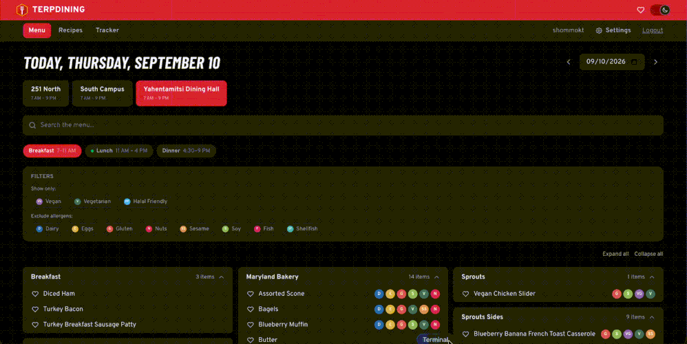
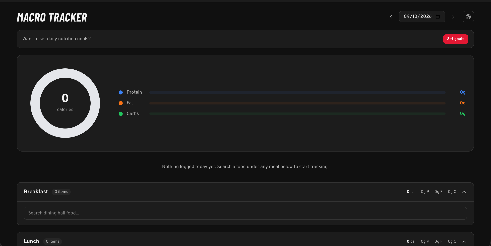
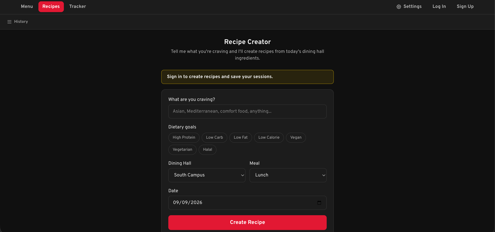

<p align="center">
  
</p>

# 🐢 TerpDining

[](https://github.com/shommokt-ui/terpdining/actions/workflows/ci.yml)

UMD dining hall app. Check menus, track macros, and get AI recipe ideas from
what's actually on the menu today, on web, iOS, and Android. Unofficial
student project, not affiliated with or endorsed by the University of
Maryland.

## Screenshots

| Menu | Tracker | Recipe Creator |
|---|---|---|
|  |  |  |

## What it does

- **Menu**: every dining hall by meal and station, with dietary badges (vegan, halal, allergens) and a date picker.
- **Favorites**: heart an item to get notified when it's back on the menu.
- **Recipes**: AI suggests dishes assembled from what's actually available that day.
- **Tracker**: log food with realistic portions, see daily macros on a donut chart, goals synced across devices.

## Stack

| | |
|---|---|
| Backend  | FastAPI, SQLite, JWT auth, bcrypt |
| Frontend | React 19, Vite, Tailwind v4, React Router |
| Mobile   | Capacitor (iOS + Android) |
| Recipes  | LangChain + OpenAI |
| Scraping | BeautifulSoup, requests, APScheduler |
| Data     | nutrition.umd.edu |

## Running it locally

Needs Python 3.11+, Node 18+, and an OpenAI key (only for `/api/recipe`).

```bash
python -m venv .venv && source .venv/bin/activate
pip install -r requirements.txt
cp .env.example .env          # fill in OPENAI_API_KEY

python run_scraper.py         # seed menu data
cd frontend && npm install && cd ..

python -m uvicorn server:app --reload   # http://127.0.0.1:8000
cd frontend && npm run dev              # http://localhost:5173
```
